# -Zomato-Excel-Dashboard-Analysis
An interactive Excel dashboard analyzing Zomato restaurant data using Pivot Tables and Charts, LOOKUP Functions and Conditional Formatting.
This project focuses on the global presence of Zomato and the availability of its services across various cities amd countries. Zomato is an Indian online food ordering and delivery service owned by Eternal Limited. Zomato is a global restaurant aggregator and food delivery service based in India. It offers information, menus, and user reviews for restaurants, along with food delivery options from partnered establishments surapssing 3,200+ cities and a focus on expanding into smaller towns in India. Zomato began as a restaurant aggregator, providing menu information, user reviews, and recommendations, and expanding to more than 20 countries. In this Excel project, I utilized Excel features to develop an interactive dashboard. I illustrated the global connection of Zomato and its overall ratings across 15 different countries and 9551 cities. Additionally, I outlined the total number of restaurants in those countries and the types of services available, such as whether they offer online delivery, if they can deliver immediately, and if they have table booking options. Based on this information, I created an appealing interactive dashboard categorized by country focussing on the top three cities, cuisines, restaurants, and localities.

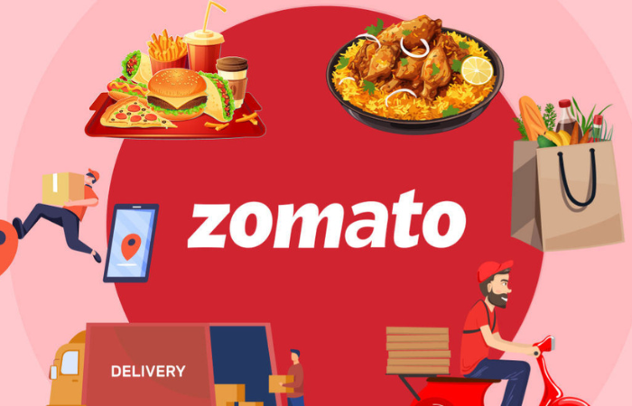

----------------------------------------------------------------------------------------------------------------------------------------------------------------------------------------------------------------------

#- This Project Includes:
- **Identifying the problem:** - I first understood the data and its various variables using my analytical skills.
- **Data Cleaning and Processing:** Converted the data into a table with filters, deleted any duplicate entries, changed data type, separated columns using the text-to-column approach, and utilized VLOOKUP.
- **Performing Descriptive Analysis:** Inserted many useful Pivot tables from the processed data and generated KPIs from them.
- **Data Visualization:** Constructed several major insights to extract vital information from a Pivot Chart.
- **Enhanced Formatting:** Changed the format of the charts using Format Painter.
- **Dashboard Creation:** I created a meaningful dashboard by combining all of the necessary charts and incorporating additional features like as Slicers, KPI and Insights.

 ---------------------------------------------------------------------------------------------------------------------------------------------------------------------------------------------------------------------
 # - Project KPI:
 In this Project, I have calculated the total numbers of worldwide restaurant as KPI, i.e. 9551 out of which India has the maximum number of restaurants with 149k votes and the presenece in 15 votes.

---------------------------------------------------------------------------------------------------------------------------------------------------------------------------------------------------------------------
# - Important Highlights derived from the project:

1. Which cities have the most restaurants listed on Zomato ?
2. Are there any countries where Zomato has a particularly strong or weak presence based on the number of restaurants?
3. Which cuisines are predominantly offered by restaurants that also offer online delivery?
4. What are the top 10 most popular cuisines offered across all restaurants in the dataset?
5. What is the average cost for two people across all restaurants?
6. What percentage of restaurants offer table booking versus online delivery?
7. What is the average aggregate rating for all restaurants?
8. Are there particular localities that have a higher concentration of highly-rated restaurants?
9. Which currencies are most commonly used across the restaurants in the dataset?
10. What percentage of restaurants offer switch to order menu?

--------------------------------------------------------------------------------------------------------------------------------------------------------------------------------------------------------------------
# - Based on the report Insights, here are the results:
1. The city-wise distribution of Zomato restaurant listings suggests a high prevalence in metropolitan areas. 

   •	New Delhi has the highest number of restaurants (5,473).

   •	Gurgaon (1,118) and Noida (1,080) follow as secondary hubs.

   •	Other cities like Lucknow, Guwahati, Ghaziabad, Faridabad, Bhubaneswar, Amritsar, and Ahmedabad have very few listings (around 21–25 each).

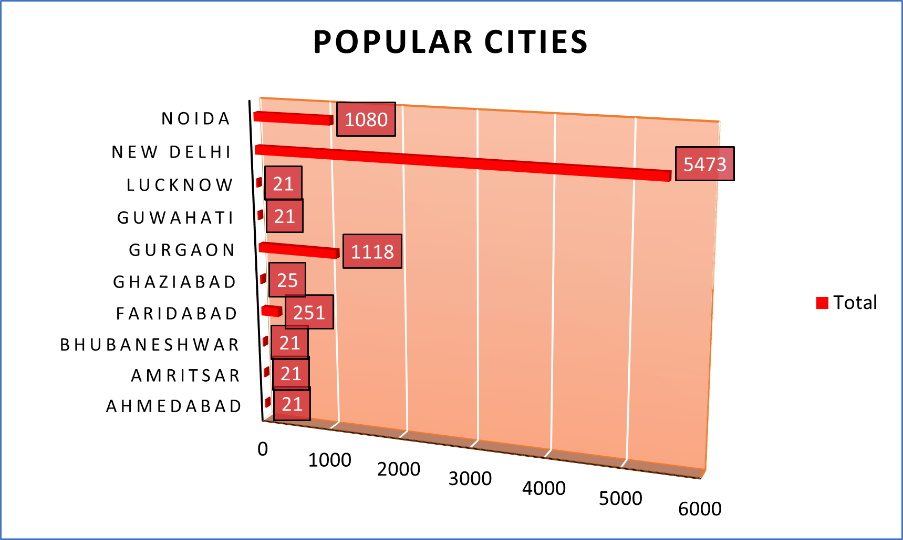

2. Zomato's restaurant network focuses largely on India, reflecting its birthplace and major market.
   
   •	India dominates with 91% of all restaurant listings.

   •	Philippines follows with 7%.

   •	Brazil and New Zealand each hold 1%.
   
   •	Australia, South Africa, and Turkey show 0%, indicating negligible or no representation.

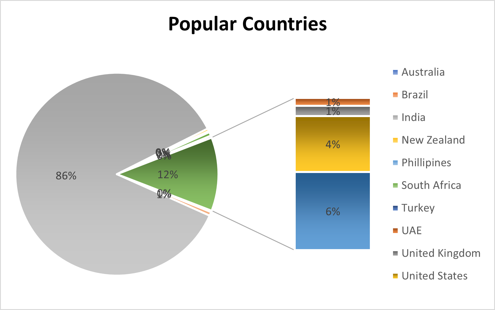

3. Considering the popularity of swift-service formats and the strong desire for convenience, Fast Food restaurants are the most likely to provide online delivery.
   
   •	Fast Food – Highest count
   
   •	Bakery and Chinese, Thai - Large Online Delivery Presence
   
   •	North Indian - Appears multiple times, possibly due to inconsistent labelling

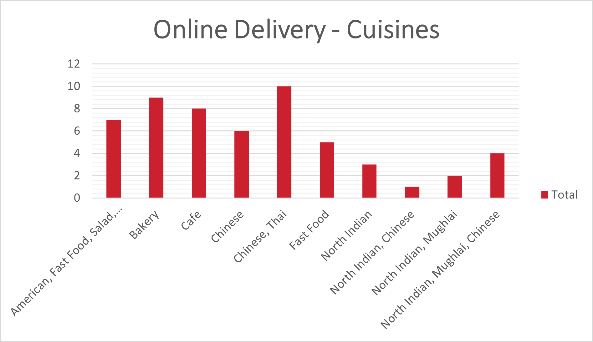

4. North Indian Cuisine significantly influences the offerings on Zomato, either as standalone options or alongside Chinese and Mughlai dishes.
    The most frequently offered cuisines are:
   
   • North Indian – 27%
   
   • North Indian + Chinese – 21%
   
   • Chinese – 15%
   
   • Fast Food – 10%
   
   • North Indian + Mughlai – 10%
   
   • Cafe – 9%
   
   •	Bakery – 8%
   
   • North Indian + Mughlai + Chinese – 6%
   
   • Bakery (variant) – 5%
   
   • Bakery + Desserts – 4%

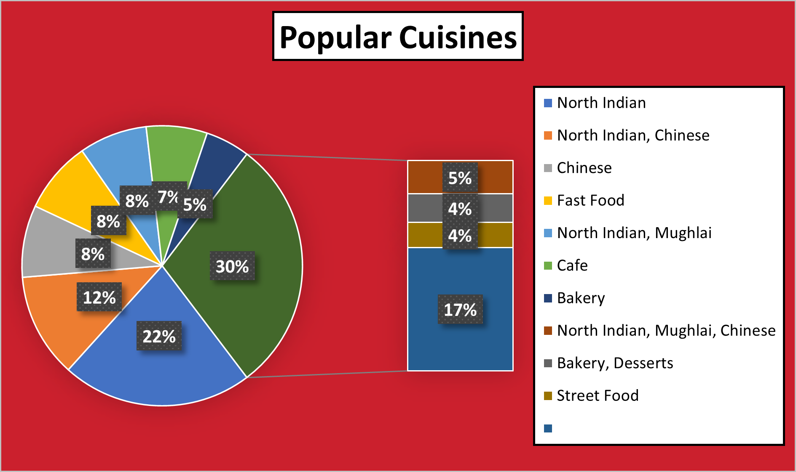

5. A premium-dining skew can be seen in the dataset.
   
   •	Satoo - Hotel and Skye are the most expensive, each at ₹800,000.
   
   •	Union Deli and Zenbu are the most affordable, each at ₹200,000.
   
   •	Most restaurants fall between ₹250,000–₹450,000, suggesting a mid-to-premium pricing tier
 
 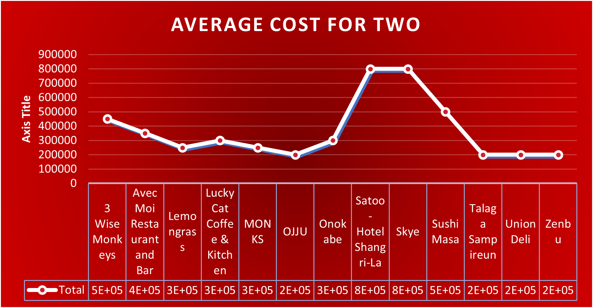

 6. Nearly 70% of the restaurants do not provide online delivery or table reservations, indicating a high concentration of conventional dine-in restaurants or smaller vendors who have not yet incorporated   digital services. Online delivery is somewhat more popular than table reservations among the remaining 30%, suggesting a move toward convenience-driven dining experiences.
    
    •	~70% of restaurants offer neither table booking nor online delivery.
    
    •	The remaining ~30% are split across:
    
        • Yes Table booking + No Online delivery
    
        •	Yes Table booking + Yes Online delivery
    
        •	No Table booking + Yes Online delivery
    
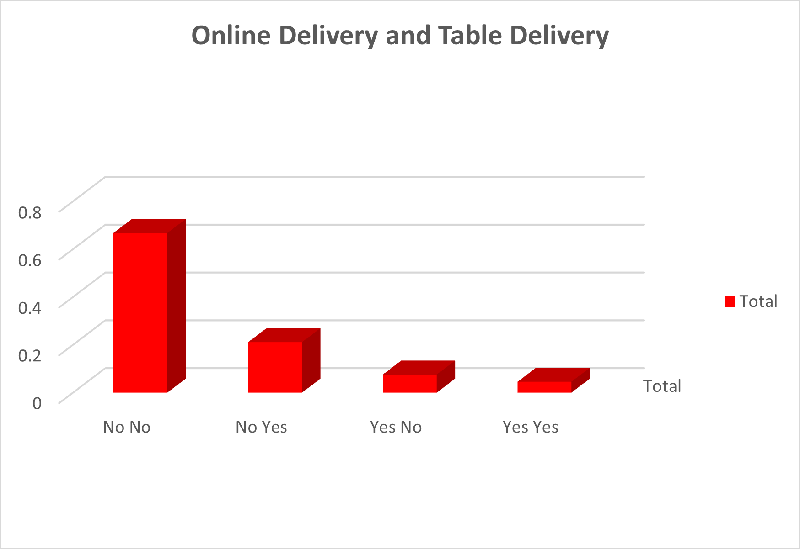

7. The Zomato Restaurant data reflects No solitary restaurant tops the rating distribution in the dataset, which shows a collection of highly regarded eateries.
   
   The chart compares ratings for four restaurants:
   
   •	Atlanta Highway Seafood Market
   
   •	Bao
   
   •	Braseiro da Gívea
   
   •	CakeBee

   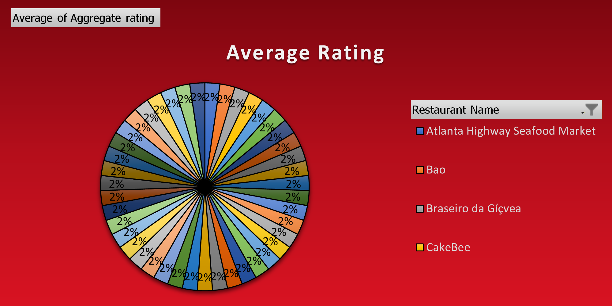

8. According to the data, Aminabad and the group it is linked with have a far larger percentage of highly rated restaurants - 34 % of the average rating overall.
   
   The legend identifies key localities:
   
   •	Aminabad
   
   •	Barwa Towers, Al Sadd
   
   •	Beak Street, Soho
   
   •	Bebek

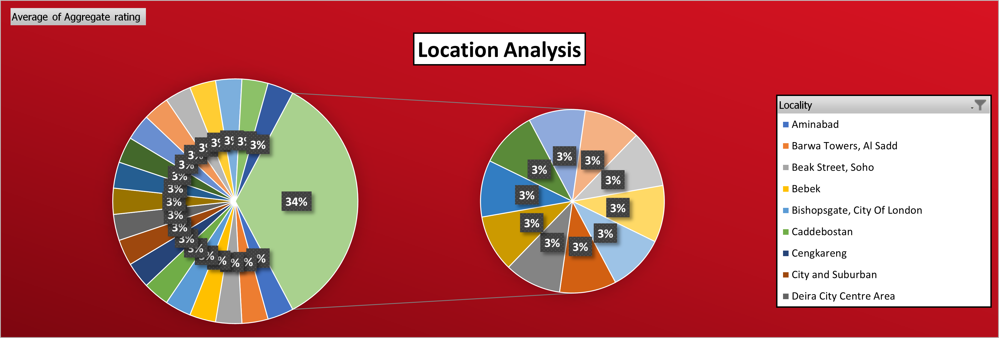  
  
  9. According to the statistics, multinational or multi-regional businesses like Domino's, McDonald's, and Subway are linked to a greater variety of currencies.
      
     From the chart:
     
       •	Cafe Coffee Day and Domino’s Pizza show the highest currency counts, suggesting they operate in multiple regions or have diverse pricing formats.
     
       •	Subway, Green Chick Chop, and McDonald’s follow closely, indicating broad geographic presence.
     
       •	Restaurants like Bikanervala, Baskin Robbins, and Barbeque Nation show lower counts, possibly reflecting more localized operations.

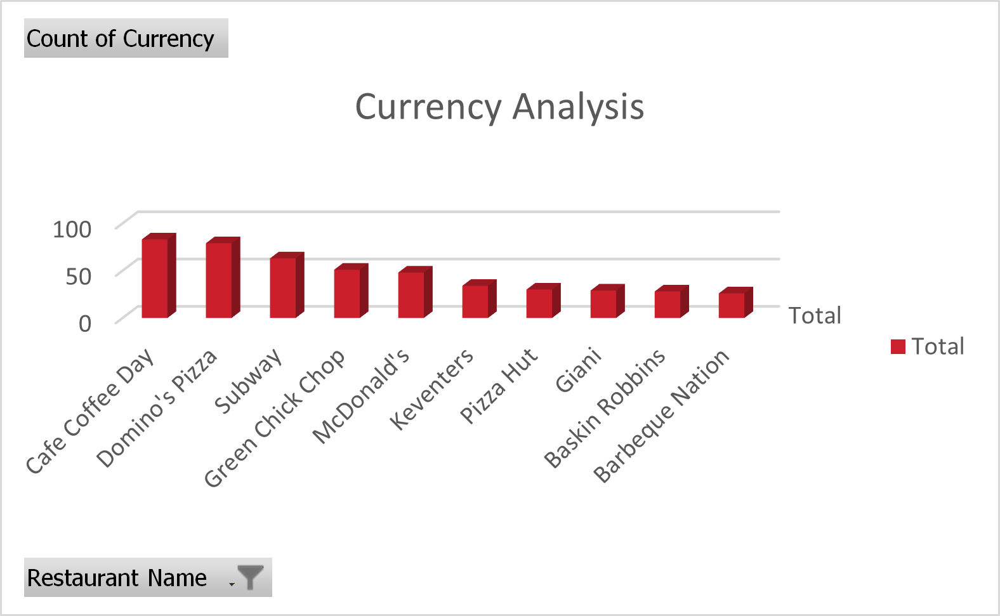

   10. According to the research, well-known quick-service restaurants like Domino's and Subway encourage the most interaction with the order menu, most likely as a result of their robust delivery networks and online visibility.
       
       From the chart:
       
        •	Restaurants like Domino’s Pizza, Subway, and Cafe Coffee Day show the highest counts of switches to the order menu.
       
        •	All listed restaurants have non-zero bars, suggesting they do offer the switch-to-order feature.

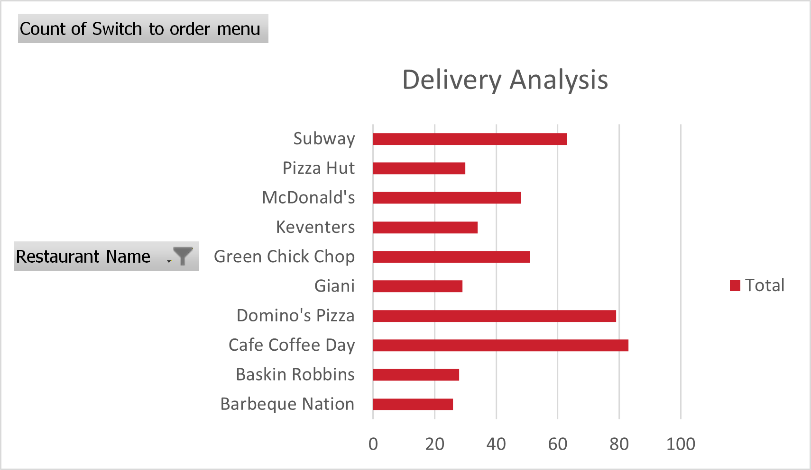

------------------------------------------------------------------------------------------------------------------------------------------------------------------------------------------------------------------------------------------
# - Conclusion 
   This project helps analyze Zomato’s market presence and business reach. The analysis shows that although Zomato operates in 15 countries, its strongest market is India, where it has expanded extensively. A majority of top restaurants    and food categories are concentrated in Indian cities, especially Bangalore, Gurgaon, and Delhi, which act as its primary business hubs. The project highlights that by strengthening advanced services and operational strategies, Zomato has the potential to further expand into global markets.

The main objective of this project was to gain insights into Zomato’s network, business patterns, and market connections while also developing practical Excel skills. It involved real-world data cleaning, exploratory data analysis, and dashboard creation to uncover meaningful insights and improve understanding of how data analysis works in practice.

--------------------------------------------------------------------------------------------------------------------------------------------------------------------------------------------------------------------------------------------
# - Author: 

• @pradhansnehashish5-dev

• Snehashish Pradhan - Data Science Analyst
